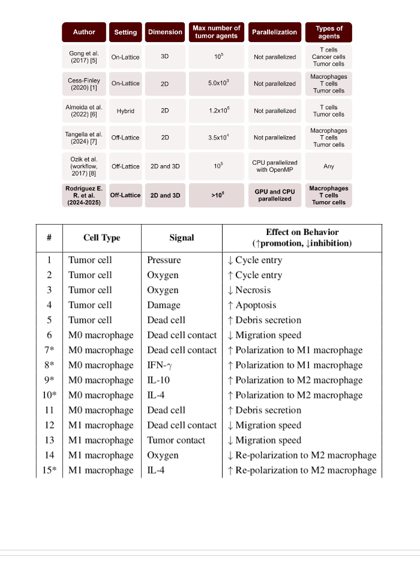
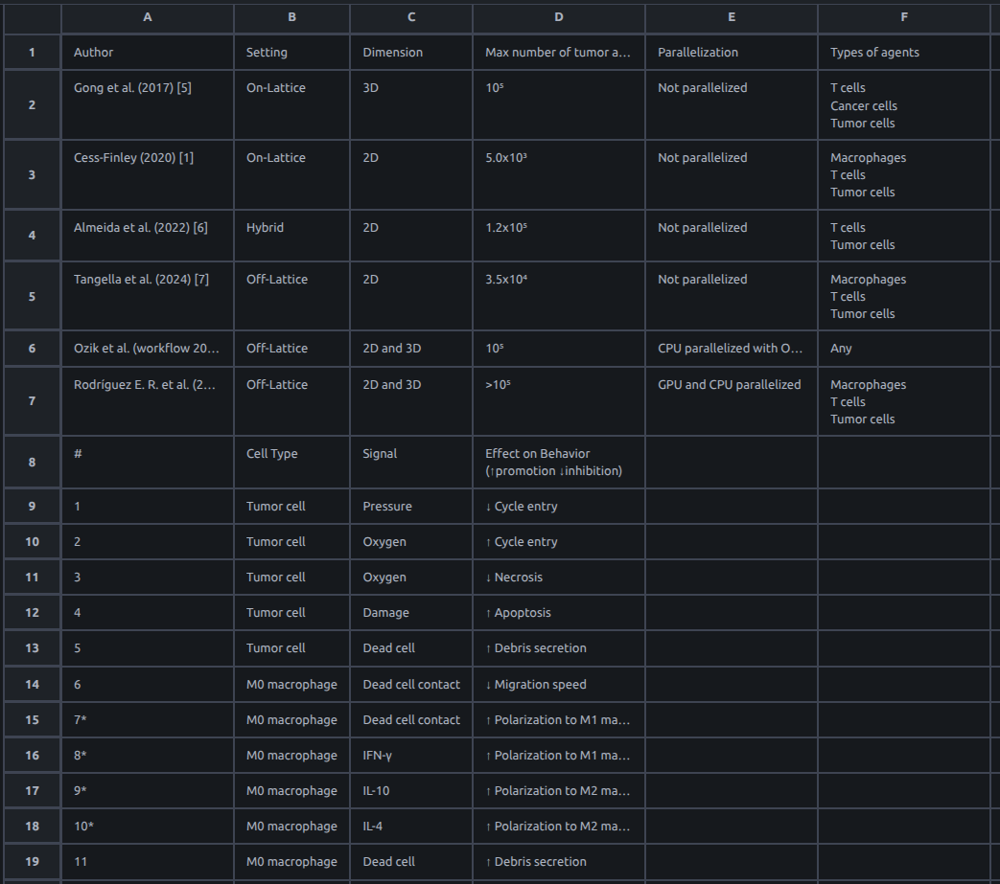
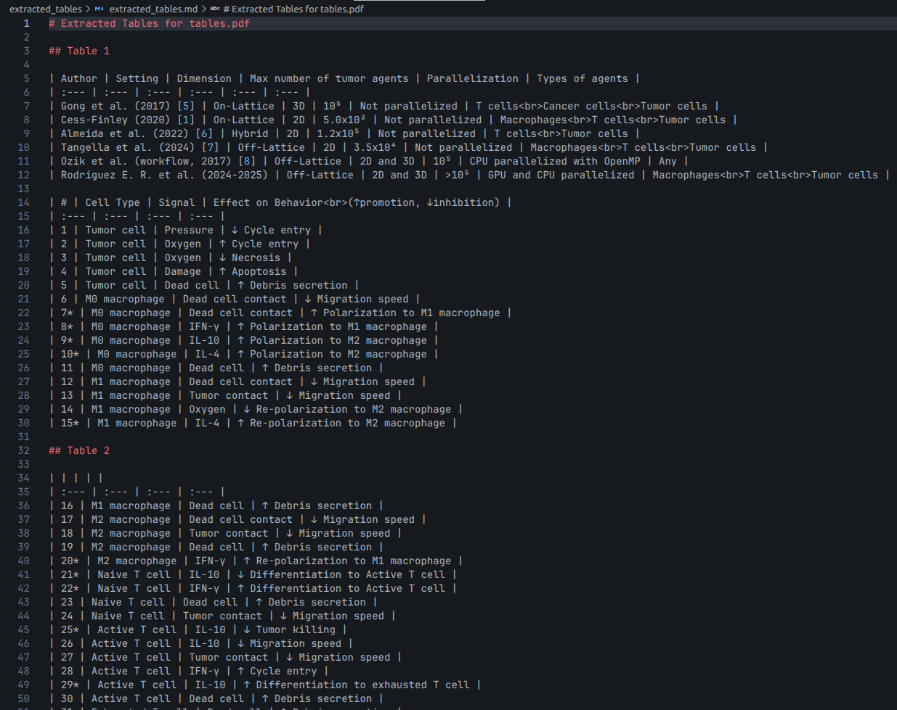
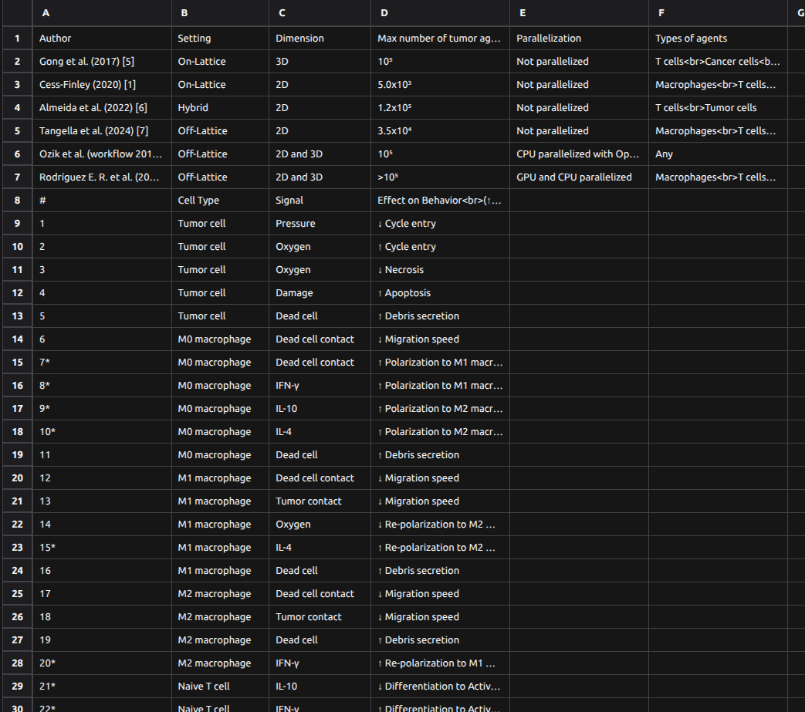
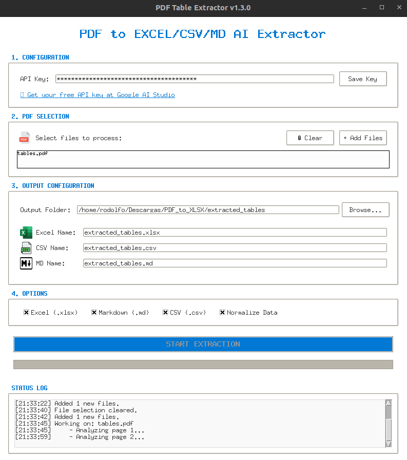
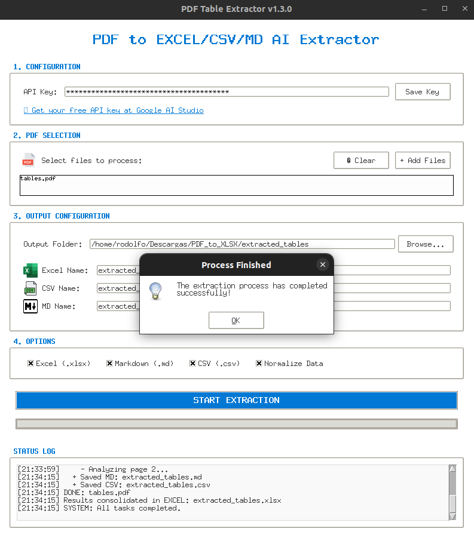

# PDF to EXCEL/CSV/MD AI Extractor

An AI-powered tool that extracts tables from PDF files by analyzing pages as images using the Gemini 3 Flash Preview model. Captures complex visual layouts that traditional text-based extractors fail to process.

_Documentation: [English](README.md) | [Español](README_ES.md)_

## 📊 Result Showcase

### Input vs. Output

| 1. Source PDF | 2. Excel Result | 3. Markdown Result | 4. CSV Result |
| :---: | :---: | :---: | :---: |
|  |  |  |  |

> [!TIP]
> **From pdf image to structured data in seconds.** Perfect for scanned documents and complex reports.

## ✨ Features

- **Multimodal AI**: Uses computer vision to extract tables exactly as they appear.
- **Graphical Interface (GUI)**: User-friendly interface with real-time logs and progress tracking.
- **Multi-format Export**: Save results to **Excel (.xlsx)**, **CSV**, and **Markdown**.
- **Data Cleaning**: Optional normalization to remove currency symbols and fix numeric formats.
- **Automated Setup**: One-click installer for Windows users.

## 🤖 LLM Compatibility & Purpose

The main goal of this project is to provide **clean, structured data** from complex PDFs. The generated formats (especially Markdown and CSV) are designed to be easily "copy-pasted" into other Large Language Models (ChatGPT, Claude, Gemini, etc.).

This allows you to leverage AI for further tasks such as:

- Converting data to **LaTeX** tables.
- Performing **deep data cleaning** or advanced analysis.
- Reformatting results into custom JSON or code structures.

## 🧠 AI Customization (Prompt Tweaking)

You can customize how the AI analyzes each page by modifying the **system prompt**. This is useful if you want to extract non-table text, request specialized formatting (like **LaTeX**), or apply custom logic.

The prompt is located in:

- **CLI**: `pdf_to_xlsx.py` inside the `process_page_images()` function.
- **GUI**: `gui_app.py` inside the `_extract_from_page()` method.

### Current Prompt
>
> _"Analyze this page and extract ALL tables you see. Even if the table looks like a screenshot or an embedded image, extract it. Return results strictly in Markdown format. Do not include any introductory text, titles outside the table, or comments. If no tables are found, return an empty string."_

By modifying these lines, you can tell Gemini to:

- _"Extract all headers and the main table..."_
- _"Format the result as a LaTeX longtable..."_
- _"Summarize the text above the table and then extract the data..."_

<!-- [](https://www.youtube.com/watch?v=tu_video_id_aqui)
_In this video, I explain how to set up the repository and use both the GUI and CLI versions._ -->

---

## 🚀 Quick Start

### For Windows

1. Download or clone this repository.
2. Double-click **`setup_windows.bat`**.
   - _This will automatically install Python (if missing), setup dependencies, and launch the app._

### For Linux (Ubuntu/Debian)

1. `sudo apt install python3-tk` (Optional: only needed for GUI).
2. `pip3 install -r requirements.txt`
3. Launch with `python3 gui_app.py` or use the CLI.

---

## 🛠️ How to Use

### Option 1: Graphical Interface (Recommended)

Launch the app to manage everything visually:

```bash
python3 gui_app.py
```

| Initial Setup | Extraction Progress |
| :---: | :---: |
|  |  |

### Option 2: Command Line (Advanced/Automation)

Run the script directly for quick processing or automation:

```bash
python3 pdf_to_xlsx.py document.pdf --clean --md --csv -o final_results.xlsx
```

- `--clean`: Normalizes data (removes '$', ',', etc.).
- `--md` / `--csv`: Generates additional formats.

---

## ⚙️ Configuration & API Key

### 1. Requirements

- Python 3.8+
- A Google Gemini API Key

### 2. Setup your API Key

1. Get your free API key from [Google AI Studio](https://aistudio.google.com/api-keys).
2. Edit the existing `api_key.env` file in the root directory and replace the placeholder:

   ```env
   API_KEY=your_gemini_api_key_here
   ```

---

## 🏗️ Technical Details

1. **Rendering**: Uses `pdfplumber` to convert pages to 300 DPI images.
2. **Analysis**: Images are sent to **Gemini 3 Flash Preview** for table detection.
3. **Parsing**: AI Markdown is converted into `pandas` DataFrames.
4. **Writing**: Results are consolidated using `openpyxl`.

## 📜 License

This project is licensed under the MIT License - see the [LICENSE](LICENSE) file for details.

---

